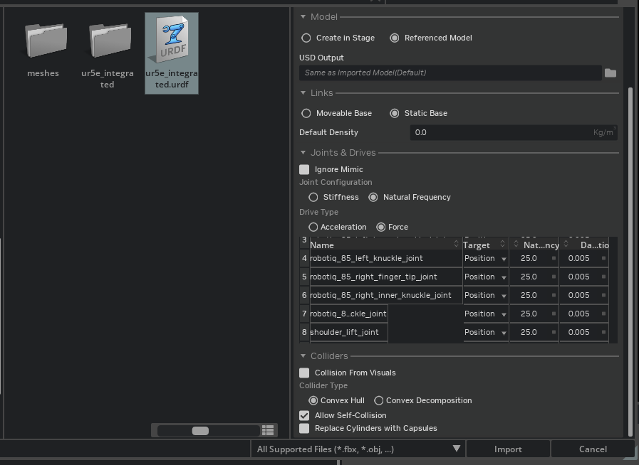
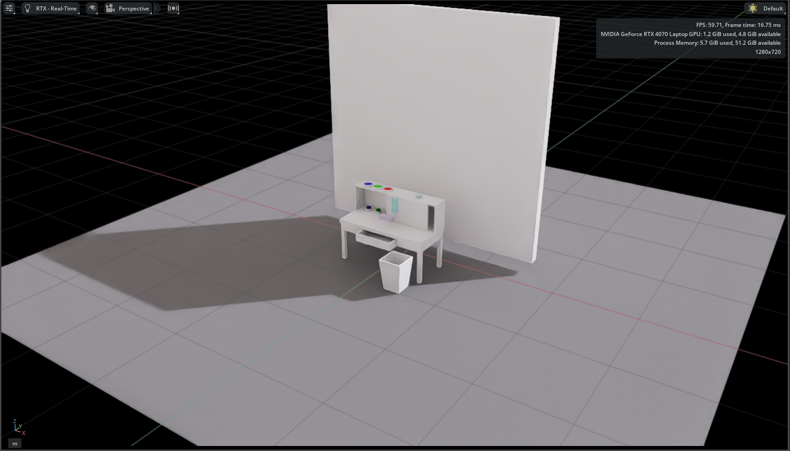
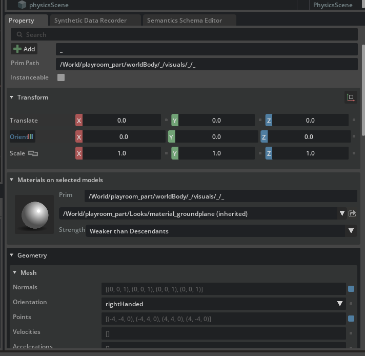
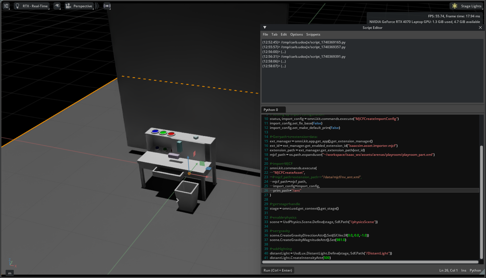

## URDF, MJCFの操作

### UR5e + Robotiq 2F-85のURDF表示
URDFはRoboManipBaselinesを参照：
[https://github.com/isri-aist/RoboManipBaselines/tree/master/robo_manip_baselines/envs/assets/isaac/robots/ur5e](https://github.com/isri-aist/RoboManipBaselines/tree/master/robo_manip_baselines/envs/assets/isaac/robots/ur5e)

URDF Import Extensionの説明は[こちら](https://docs.isaacsim.omniverse.nvidia.com/latest/robot_setup/ext_isaacsim_asset_importer_urdf.html#isaac-sim-urdf-robot-properties)

IsaacSimのドキュメントでは、[Import URDF](https://docs.isaacsim.omniverse.nvidia.com/latest/robot_setup/import_urdf.html)を参考に、
* Direct Import
* Python Script
の２点をサンプルとして試した。

Direct ImportはエクスプローラからURDFファイルを探して直接インポートする方法である。ファイル選択直後の時点でロボットの型（移動ロボットかマニピュレータか）、各関節のパラメータ、自己衝突のチェックが設定可能。特に、自己衝突はチェックをわすれやすい。



動かしてみると、関節指令値が固定されているのか、初期姿勢に戻ろうと振動する。ダンピング項が効いていると見ればこれでいいのかもしれない。指令値を送る方法はPythonなどで差し支えないので、ここではスキップする。

./videos/urdf_direct_import_play.webm

Python Scriptはサンプルの通りhello_world.pyを書き換えて実行した。FollowTargetタスクがPandaで定義されていてUR5e用は見つからないので、URDFファイルをUR5eに置き換えるとエラーが出る。FollowTargetをUR用に作れればインタラクティブマーカで操作することもできるはずなので、今後調査する。

### Google-researchのPlayroomsをMJCF表示

MJCFはgoogle-researchのplayroomから編集した＞[google-research/playrooms](https://github.com/google-research/google-research/tree/master/playrooms)

MJCF Import Extensionの説明は[こちら](https://docs.isaacsim.omniverse.nvidia.com/latest/robot_setup/ext_isaacsim_asset_importer_mjcf.html)

ドキュメントを参考に、
* Direct Import
* Python Script
を試した。

Direct ImportはURDFと同じ手順。インポート直後だとライトがオフの場合あり、シミュレーション画面右上の太陽マークから、ライティングを設定する。



MJCF自体はインポートできているが、一部パーツがロードされていない（？）様子。また、マテリアルが読み込まれず真っ白なので、Isaac流の設定方法があると思われる。`Prim Path`の設定次第と思われるので、`/World/playroom_part/Looks/material_XXXXX`が見つからないことが原因か。



Python Scriptでもパーツが真っ白だが、
```console
2025-02-24 03:56:32  [Warning] [isaacsim.asset.importer.mjcf.plugin] Material M_Wood_cube_LR has an image texture, but it won't be imported since the asset is being loaded on memory. Please import it into a destination folder to get all textures.
```
が警告されているので、やはりテクスチャは別途ロードの必要がある様子。スクリプト内の`MJCFCreateAsset`を見ても`prim_path`の設定があるので、ここで指定か。

また、ライティングもMJCFのxml内で指定するのではなく、Pythonスクリプト上で指定する模様。サンプルスクリプトだと
```python
# add lighting
distantLight = UsdLux.DistantLight.Define(stage, Sdf.Path("/DistantLight"))
distantLight.CreateIntensityAttr(500)
```
で定義している。



### URDF + MJCFの表示
### UR5eをインタラクティブマーカで操作
### UR5eおよびグリッパへ指令値を送り操作
### UR5eによる環境物の操作テスト

## 強化学習の設計

### IsaacSim (IsaacLab)での強化学習スキームの学習
### PyTorchによるPolicyを設計し、UR5eを操作（学習なし）
### （強化学習のサンプルを試す）
### 自作の強化学習モデルの準備とIsaacへの導入
### Isaac上での訓練、訓練したpolicyのによる動作テスト
### 並列環境の導入
### 並列環境での学習・動作テスト

## 模倣学習の設計

### IsaacLabでの模倣学習スキームの学習
### 学習データの収集スキーム
#### 3Dマウス
#### （GELLO）
### 学習データの収集
### 模倣学習の実施
### 訓練したpolicyのロードと動作テスト